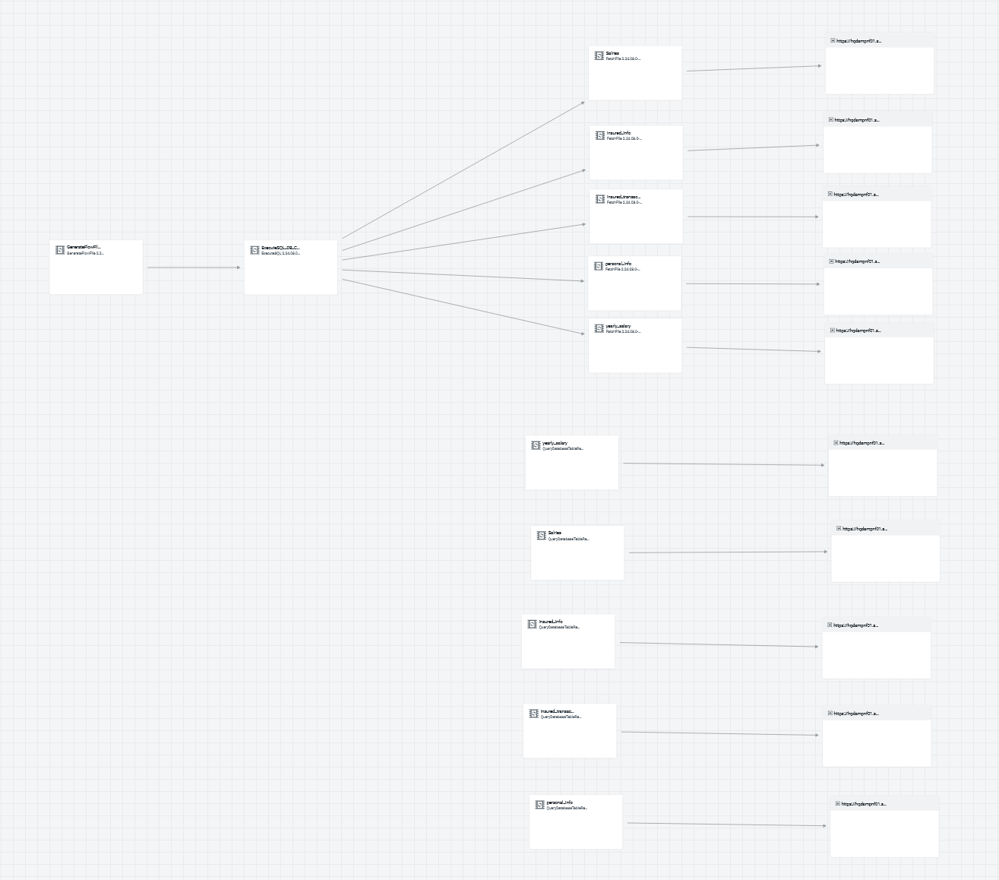
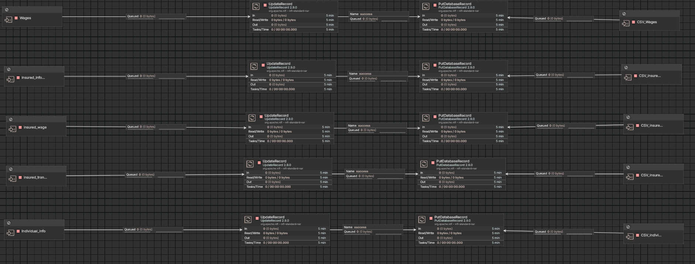

# Data Warehouse Pipeline

> Migration of a legacy **SQL Server + SSIS** ETL into a horizontally scalable lakehouse architecture. Continuous edge ingestion via **MiNiFi** feeds a **NiFi** cluster; **PySpark** transforms staged data into a **Parquet Bronze** and **Iceberg Gold** layer on **MinIO**, orchestrated by **Apache Airflow**.


---

## Overview

A two-tier **medallion data warehouse** with **edge-to-core streaming ingestion** at the source side and **distributed batch transformation** at the analytical side.

**Apache MiNiFi** runs on an edge server outside the cluster network, continuously pulling citizen-level records from the operational MySQL via `QueryDatabaseTableRecord` (keyed on an incremental `message_num` column) and shipping the result to a 2-node **central NiFi cluster** via **Site-to-Site over HTTP**. A built-in **disaster-recovery sub-flow** falls back to CSV snapshots on the edge server when the source database is unreachable. Central NiFi stamps a `load_date` lineage column and lands the records in a staging MySQL.

A daily **Airflow** DAG triggers a **PySpark job** (Spark 4.0, local mode). The job performs partitioned JDBC reads against staging, lands the raw frame as **Bronze (Parquet)** on a 3-node distributed **MinIO** cluster, applies type coercion, cross-system joins, dimensional modeling, and business rules, then writes the curated output as **Gold (Apache Iceberg)** tables. Upon completion, the pipeline automatically triggers a **monitoring DAG** that audits the Gold layer size and logs a snapshot to MySQL.

The whole stack replaces a legacy **SQL Server + SSIS** ETL that was single-speed, batch-only, and tightly coupled to a SQL transformation engine. The new design parallelizes work at **every** layer, runs continuously instead of nightly, decouples compute from storage, and keeps source-DB credentials and IPs entirely off the central NiFi cluster.

Sample dataset: **~14.4 million rows** across five tables. Real production scale: **~1.4 billion rows** (100x).

---

## Table of Contents

1. [Why this project exists](#why-this-project-exists)
2. [Architecture](#architecture)
3. [Data scale](#data-scale)
4. [End-to-end data flow](#end-to-end-data-flow)
5. [Tech stack](#tech-stack)
6. [Edge ingestion: MiNiFi](#edge-ingestion-minifi)
7. [Resilience and disaster recovery](#resilience-and-disaster-recovery)
8. [Central NiFi: receive and route](#central-nifi-receive-and-route)
9. [The Spark transformation layer](#the-spark-transformation-layer)
10. [Storage layer: MinIO + Iceberg](#storage-layer-minio--iceberg)
11. [Orchestration: Airflow](#orchestration-airflow)
12. [Gold layer monitoring](#gold-layer-monitoring)
13. [Setup](#setup)
14. [Schema, partitioning, and derived columns](#schema-partitioning-and-derived-columns)
 

---

## Why this project exists

The legacy stack was **SQL Server + SSIS**. It worked for years, but as the need evolved past nightly batch reporting, four specific limitations dominated:

1. **One speed, one machine.** SSIS executed packages at a fixed throughput ceiling with no horizontal scaling path. You could tune buffer sizes and upgrade the host, but you could not add nodes. NiFi scales by adding processors and clustering; Spark scales by adding executors across NodeManagers. There was also no native path to *streaming*, every change to source data had to wait for the next package run.
2. **Once-a-day execution.** Anything that happened during the day was invisible to the warehouse until the next morning. Modern downstream consumers (operational dashboards, near-real-time integrations) couldn't be served at all.
3. **Narrow connector ecosystem.** The customer's roadmap explicitly required direct writes to **MinIO**, **Kafka** publish/consume, heavy **text/file manipulation**, and live ingestion over **UDP and TCP** sockets, all native NiFi processors, all custom Script Component territory in SSIS.
4. **Transformation engine couldn't keep up.** Some transformations were fundamentally too heavy for SQL-on-SQL-Server. They needed a real distributed compute engine, **Spark**.

The redesign keeps business semantics identical but moves every stage onto modern, horizontally parallel primitives:

| Old (SSIS / SQL Server)                               | New (MiNiFi -> NiFi -> Spark -> Iceberg / MinIO)                          |
|---|---|
| Single-threaded "one speed" execution                  | Continuous edge capture + parallel Spark JDBC reads              |
| Once-nightly batch run                                 | MiNiFi runs 24/7; Airflow triggers Spark daily for transformation       |
| OLE DB / file / SQL Server connectors only             | NiFi processors for MinIO, Kafka, UDP, TCP, files, text manipulation    |
| Mainly SQL-only transformation engine in SSIS Data Flow       | PySpark for heavy transformations; Iceberg for ACID/evolution   |
| Compute + storage fused on one SQL Server box          | Spark and MinIO (3 nodes) scale independently |
| Source-DB credentials exposed to the ETL server        | Source DB only reachable from the edge MiNiFi; central NiFi never sees it |
| Schema changes need an SSIS package redeploy                | Iceberg schema evolution without rewriting historical data              |

---

## Architecture

Two trust zones, one logical pipeline:

- **Edge server**, outside the cluster network, close to the source MySQL. Runs only **MiNiFi** (Java), managed remotely by **Cloudera Edge Flow Manager (CEFM)**. Holds source-DB credentials. Holds CSV recovery snapshots maintained by a cron task.
- **Cluster network**, runs everything else: **2-node NiFi cluster**, **staging MySQL**, **3-node MinIO** (distributed), Spark, and **Airflow**. None of the components in this zone ever learn the source database's hostname or credentials.

**Two execution rhythms:**

- **MiNiFi runs continuously**, picking up new rows the moment they appear in the source MySQL, the streaming layer.
- **Airflow + Spark run daily**, snapshotting whatever NiFi has accumulated into staging and producing the day's Bronze + Gold outputs, the analytical layer. After each run, a monitoring DAG automatically audits the Gold layer.


---

## Data scale
The repository ships with a **sample dataset** sized to be reproducible on modest hardware. Real production volume is **~100x**.
| Table | Sample rows | Spark partition column |
|---|---:|---|
| `wages`               | 6,000,030  | `SSN`        |
| `individual_info`     | 4,398,818  | `Birth_Date` |
| `insured_information` | 2,000,000  | `SSN`        |
| `insured_transaction` | 1,000,000  | `SSN`        |
| `insured_wage`        | 1,000,000  | `SSN`        |
| **Total**             | **~14.4 M**| |


---

## End-to-end data flow

1. **MiNiFi** on the edge runs `QueryDatabaseTableRecord` against each source table, using `message_num` (an incremental column on the source) as the maximum-value column for incremental state. Only rows newer than the persisted state (in MiNiFi's local state store) get fetched.
2. In parallel, a **disaster-recovery sub-flow** on MiNiFi attempts an `ExecuteSQL` probe on a schedule. If the probe fails (source DB unreachable), the failure relationship routes to `FetchFile` processors that pull the latest CSV backup snapshots from local disk. Either path lands on the same Site-to-Site sink.
3. **Site-to-Site over HTTP** ships the resulting flowfiles from the edge to the central NiFi cluster's Input Port. S2S handles back-pressure, retry, and resumable transfer natively.
4. **Central NiFi** routes from the Input Port through `UpdateRecord` (which stamps `load_date = ${now():format('yyyy-MM-dd HH:mm:ss')}`) and `PutDatabaseRecord` into the staging MySQL (`datasource` database).
5. **Airflow** fires daily and runs the `dwh_pipeline` DAG, which `spark-submit`s the PySpark job.
6. **Spark** discovers numeric bounds per table (`SELECT MIN/MAX(partition_col)`), performs parallel JDBC reads with cursor-based fetching, lands the raw frame in the **Bronze** bucket as Parquet, applies type casts and business rules, and writes the curated result as **Gold** Iceberg tables.
7. Upon Spark completion, `dwh_pipeline` triggers the **`monitoring_dag`**, which queries the Gold bucket size on MinIO and inserts an audit record into the `gold_bucket_monitoring` MySQL table.

---

## Tech stack

| Layer | Technology | Why |
|---|---|---|
| **Source** | MySQL (operational, on edge-adjacent network) | System of record; only the edge MiNiFi ever connects to it |
| **Edge agent** | Apache MiNiFi (Java) | Lightweight footprint; network-isolated from the cluster; full processor compatibility with NiFi |
| **Edge orchestration** | Cloudera Edge Flow Manager (CEFM) | Centralized configuration, version, and deploy management for the edge agent |
| **Central routing** | Apache NiFi (2-node cluster) | Receives via Input Port; stamps `load_date`; writes to staging MySQL |
| **Staging DB** | MySQL 8 (`datasource`) | Allows Spark to process it at full parallelism without affecting the operational source |
| **Compute** | PySpark 4.0 (local mode) | Distributed transformation; Iceberg and hadoop-aws loaded via `--packages` |
| **Bronze storage** | MinIO (3-node distributed) + Parquet | S3-compatible, erasure-coded |
| **Gold storage** | MinIO + Apache Iceberg | ACID, time travel, schema/partition evolution |
| **Orchestration** | Apache Airflow 3.0.6 | Daily scheduling, DAG chaining, log centralization |
| **Monitoring** | Python + MinIO client + MySQL | Post-run Gold layer size audit logged to `gold_bucket_monitoring` |
| **Runtime** | Java 21 OpenJDK, Python 3.12 | |

---

## Edge ingestion: MiNiFi

 


### Why MiNiFi instead of putting NiFi on the edge?

Two reasons:

1. **Lightweight footprint.** MiNiFi is designed for edge deployment, minimal heap, It runs comfortably on an edge box that can't justify a full NiFi installation.
2. **Network isolation.** Source database hostnames, credentials, and JDBC URLs **never leave the edge server**. Central NiFi only ever sees an inbound Site-to-Site connection from the edge; it has no route to, no knowledge of, and no credentials for the operational source. A compromised central NiFi node cannot pivot to the source database, because it doesn't have what it would need.

### Management: Cloudera Edge Flow Manager (CEFM)

The edge agent is configured, versioned, and deployed remotely from **Cloudera Edge Flow Manager**. The MiNiFi instance on the edge pulls its flow definition from CEFM on boot and on demand; flow updates are pushed centrally without SSHing onto the edge box.

### The two MiNiFi sub-flows

The same MiNiFi canvas hosts two structurally independent ingest paths:

**(1) Primary, routine incremental capture**

```
QueryDatabaseTableRecord (per source table)
    │  • Table_Name = <source_table>
    │  • Maximum-Value Columns = message_num
    │  • Record Writer = AvroRecordSetWriter
    ▼
Remote Process Group -> <central-nifi-host>:S2S Input Port
```

One `QueryDatabaseTableRecord` instance per source table. The processor tracks the watermark of `message_num` in its persistent state, so each cycle picks up only rows with `message_num > last_seen`. No external state store needed; it's handled by MiNiFi's local state.

**(2) Fallback, disaster recovery from CSV snapshots**

```

ExecuteSQL (probe / fetch from source MySQL)
    │
    ├── success ─► (terminate, The other flow will handle it)
    │
    └── failure ─► FetchFile (per table, points at CSV backup on edge disk)
                       │
                       ▼
                   Remote Process Group -> <central-nifi-host>:S2S Input Port
```

When the source MySQL is unreachable, `ExecuteSQL`'s `failure` relationship routes the flowfile to `FetchFile`, which reads the latest CSV snapshot from local disk. The CSV snapshots themselves are produced and rotated by a **cron job on the customer's operating system**, fully outside this pipeline's responsibility. From the central NiFi's perspective, the failover is invisible.


---

## Resilience and disaster recovery

| Failure mode | Detection | Recovery |
|---|---|---|
| Source MySQL unreachable | `ExecuteSQL` failure relationship | `FetchFile` reads CSV snapshot maintained by customer cron; Site-to-Site sink is unchanged |
| S2S transport interrupted | Built-in S2S retry + back-pressure | NiFi side queues; MiNiFi resumes from last acknowledged batch |
| Central NiFi node down | 2-node cluster + ZK-coordinated failover | The other node continues serving the Input Port |
| Staging MySQL write fails | `PutDatabaseRecord` failure relationship + NiFi back-pressure | Flowfile queues on NiFi disk until staging recovers |
| Spark job fails mid-run | Airflow task failure + retry | Re-run filters by `load_date > last_success` (planned, see [Roadmap](#roadmap)) |
| MinIO node down | 3-node distributed erasure coding | Writes continue against surviving quorum |

The pattern across all of these is the same: failure is detected at the closest possible point, and the recovery action is local.

---

## Central NiFi: receive and route




Central NiFi's job is intentionally narrow:

```
S2S Input Port
    │
    ▼
UpdateRecord  ──  adds load_date = ${now():format('yyyy-MM-dd HH:mm:ss')}
    │
    ▼
PutDatabaseRecord  ──  JDBC batch insert into datasource.<table>
```

No source-database connection. No source credentials. No source IPs in the flow definition. The Input Port is the only thing reachable from outside the cluster.

The 2-node cluster runs in active-active mode; either node can serve the Input Port and either node can run the downstream processors.

---

## The Spark transformation layer

The full job lives in `scripts/DWH_Pipeline.py`. Spark 4.0 is used in local mode; `--packages` pulls in the Iceberg runtime and hadoop-aws at submit time so no manual jar management is needed.

### 1. Dynamic bounds discovery + parallel JDBC read

```python
bound = spark.read \
    .format("jdbc") \
    .option("driver", "com.mysql.cj.jdbc.Driver") \
    .option("url", MYSQL_URL) \
    .option("fetchsize", "5000") \
    .option("dbtable", f"""(SELECT min({partition_col}) low_bound,
                            max({partition_col}) as up_bound
                    FROM datasource.{table}) as tbl""") \
    .option("user", MYSQL_USER) \
    .option("password", MYSQL_PASSWORD) \
    .load().collect()[0]

if bound[0] is None or bound[1] is None:
    raise ValueError(f"Table '{table}' appears to be empty — "
                     f"MIN/MAX on '{partition_col}' returned NULL. "
                     f"Aborting to avoid a full-scan read.")

df = spark.read \
    .format("jdbc") \
    .option("driver", "com.mysql.cj.jdbc.Driver") \
    .option("url", MYSQL_URL) \
    .option("dbtable", table) \
    .option("user", MYSQL_USER) \
    .option("password", MYSQL_PASSWORD) \
    .option("partitionColumn", partition_col) \
    .option("lowerBound", bound[0]) \
    .option("upperBound", bound[1]) \
    .option("numPartitions", partitions_num) \
    .option("fetchsize", "5000") \
    .load()
```

Instead of hardcoding bounds (which goes stale the moment rows are added), the job **discovers them at runtime** with a cheap MIN/MAX query, then issues concurrent `WHERE partition_col BETWEEN x AND y` queries against MySQL, with the partition count tuned per table. The null guard catches empty tables before they produce a confusing JVM error. Cursor-based fetch (`fetchsize=5000`) keeps the JDBC driver from materializing entire result sets in memory.


### 2. Automatic type conversion

The source columns arrive as strings. The job re-types them on read:

```python
.withColumn("National_Number",        safe_long("National_Number"))
.withColumn("Gender",                 safe_int("Gender"))
.withColumn("Religion_Code",          safe_int("Religion_Code"))
.withColumn("Birth_Kada_Code",        safe_long("Birth_Kada_Code"))
.withColumn("Father_National_Number", safe_long("Father_National_Number"))
.withColumn("Mother_National_Number", safe_long("Mother_National_Number"))
```

`safe_long` and `safe_int` are thin wrappers that coerce empty strings to `NULL` before casting, so a blank field doesn't produce a cast failure. `Religion_Code` is treated as `int` because it is known to occasionally contain non-numeric junk in legacy rows; returning `NULL` instead of throwing means a single malformed value doesn't fail the whole stage.

### 3. Cross-system join and dimensional modeling

The two source systems are linked by `National_Number`:

```python
def natNumber_filter(table):
    return Individual_info_stg[['National_Number']] \
        .join(table, "National_Number", "inner")
```

This filters insurance tables down to individuals who exist in the civil registry, eliminating orphan records before they hit Gold.

**A real dimension:**

```python
dim_country = spark.sql(
    "SELECT DISTINCT Birth_Country_Code, Birth_Country "
    "FROM Individual_info_stg")
Individual_info_dip = Individual_info_dip.drop("Birth_Country")
```

`Birth_Country` (the descriptive string) is lifted into its own `dim_country` table; the fact-side `individual_information` keeps only `Birth_Country_Code`. Textbook star-schema normalization.

### 4. `IS_Diplomat` derived flag

```python
Individual_info_dip = spark.sql("""
    SELECT *,
           CASE WHEN Passport_Number LIKE '0000%'
                THEN 1 ELSE 0 END AS IS_Diplomat
    FROM Individual_info_stg
""")
```

A boolean flag derived from the passport-number prefix, computed once at write time so downstream consumers don't have to re-encode the rule.

### 5. Bronze and Gold writes

```python
def write_objects(destination, bucket, entity, df, table):
    date = datetime.now()
    timestamp = date.strftime("%Y%m%d_%H%M%S")
    path = f"s3a://{bucket}/{entity}/{table}/{date.year}/{date.month}/{date.day}"

    if destination.lower() == 'staging':
        df.write.parquet(f"{path}/{table}_{timestamp}")
    elif destination.lower() == 'dwh':
        df.writeTo(
            f"iceberg.{entity}.{table}.`{date.year}`.`{date.month}`.`{date.day}`"
        ).createOrReplace()
    else:
        raise ValueError(f"Unknown destination '{destination}'. Expected 'staging' or 'dwh'.")
    return df
```

- **Bronze (`dest.data`)**, timestamped Parquet directories, one per run. Immutable. Cheap to reprocess.
- **Gold (`dest.data.gold`)**, Iceberg tables with date-hierarchical namespacing. ACID writes, time travel via snapshots, schema evolution without rewriting data.

---

## Storage layer: MinIO + Iceberg

### MinIO, 3-node distributed cluster

Three MinIO nodes form a single distributed cluster with **erasure coding**: data is sharded across nodes with parity blocks, so the cluster tolerates node loss without losing data and continues to serve reads and writes during single-node failure.

Spark talks S3A to the cluster:

```python
.config("spark.hadoop.fs.s3a.endpoint", "http://<minio-endpoint>:9000")
.config("spark.hadoop.fs.s3a.path.style.access", "true")
.config("spark.hadoop.fs.s3a.aws.credentials.provider",
        "org.apache.hadoop.fs.s3a.SimpleAWSCredentialsProvider")
```

`path.style.access=true` is mandatory for MinIO.

### Iceberg catalog wiring

```python
.config("spark.sql.catalog.iceberg", "org.apache.iceberg.spark.SparkCatalog")
.config("spark.sql.catalog.iceberg.type", "hadoop")
.config("spark.sql.catalog.iceberg.warehouse", "s3a://dest.data.gold/")
```

A **Hadoop-type** Iceberg catalog (no external Hive Metastore nor Nessie), Iceberg stores its own metadata as files alongside the data. Self-contained, single-writer-safe. Migrating to a REST catalog (Nessie, Polaris) for multi-writer or external query engine support is a config change, not a rewrite.

---

## Orchestration: Airflow

The pipeline is split across two DAGs.

### `dwh_pipeline`

Runs `@daily`. Uses the Airflow 3 `@dag` decorator style and `airflow.providers.standard` imports.

```python
from airflow.decorators import dag
from airflow.providers.standard.operators.bash import BashOperator
from airflow.providers.standard.operators.trigger_dagrun import TriggerDagRunOperator
from datetime import datetime

@dag(
    dag_id="dwh_pipeline",
    start_date=datetime(2026, 6, 1),
    schedule="@daily",
    catchup=False,
    tags=["dwh", "spark"],
)
def dwh_pipeline():
    run_spark = BashOperator(
        task_id="run_spark_pipeline",
        bash_command="""
            /mnt/c/Users/yazan/Downloads/spark-4.0.0-bin-hadoop3/spark-4.0.0-bin-hadoop3/bin/spark-submit \
                --driver-memory 16g \
                --packages org.apache.iceberg:iceberg-spark-runtime-4.0_2.13:1.10.1,org.apache.hadoop:hadoop-aws:3.4.1 \
                /home/yazan/airflow/scripts/DWH_Pipeline.py
        """,
    )
    trigger_monitoring = TriggerDagRunOperator(
        task_id="trigger_monitoring",
        trigger_dag_id="monitoring_dag",
        wait_for_completion=False,
    )
    run_spark >> trigger_monitoring

dwh_pipeline()
```

**Design choices:**

- `catchup=False`, no point firing historical runs on first deploy.
- `BashOperator` over `SparkSubmitOperator`, keeps the Airflow Spark provider out of the venv, and the bash command is the exact same string that works manually, which is invaluable for debugging.
- Dependencies (Iceberg runtime, hadoop-aws) are resolved at submit time via `--packages`, no manual jar management needed.
- After Spark completes, `TriggerDagRunOperator` fires `monitoring_dag` with `wait_for_completion=False`, so the main pipeline does not block waiting for the audit to finish.

### `monitoring_dag`

Triggered only (`schedule=None`), never runs on its own schedule. Uses the Airflow 3 `@dag` / `@task` TaskFlow API from `airflow.sdk`.

```python
import pendulum
from airflow.sdk import dag, task
from scripts.monitor_gold_layer import monitor_gold_bucket

@dag(
    schedule=None,
    start_date=pendulum.datetime(2026, 1, 26, tz="UTC"),
    catchup=False,
    tags=["monitoring", "gold_layer"]
)
def monitoring_dag():
    @task
    def monitor():
        monitor_gold_bucket()
    monitor()

monitoring_dag()
```

The single `monitor` task calls `monitor_gold_bucket()` from `scripts/monitor_gold_layer.py`. See [Gold layer monitoring](#gold-layer-monitoring) for what that function does.

---

## Gold layer monitoring

After every successful Spark run, the `monitoring_dag` executes `monitor_gold_bucket()` from `scripts/monitor_gold_layer.py`. The function:

1. Connects to MinIO using credentials loaded from a `.env` file.
2. Iterates over all objects in the `dest.data.gold` bucket recursively and sums their sizes.
3. Converts the total to MB and collects bucket metadata (name, creation date).
4. Inserts a timestamped audit row into the `gold_bucket_monitoring` table in the `datasource` MySQL database.

```python
insert_query = """
    INSERT INTO gold_bucket_monitoring (bucket_name, creation_date, size_mb, monitoring_date)
    VALUES (%s, %s, %s, %s)
"""
```

This gives a queryable growth history of the Gold layer: one row per pipeline run, recording exactly how large the bucket was at the time of each load.

The full post-Spark chain is:

```
dwh_pipeline (Spark job)
    └── trigger_monitoring
            └── monitoring_dag
                    └── monitor()
                            └── monitor_gold_bucket()
                                    ├── Query MinIO gold bucket size
                                    └── INSERT into gold_bucket_monitoring (MySQL)
```
 
---

## Setup

```bash
# Java 21
export JAVA_HOME=/usr/lib/jvm/java-21-openjdk
export PATH=$JAVA_HOME/bin:$PATH

# Python venv for Airflow
python3.12 -m venv ~/airflow_venv
source ~/airflow_venv/bin/activate
pip install apache-airflow==3.0.6

# Install monitoring dependencies
pip install minio mysql-connector-python python-dotenv

# Airflow config
export AIRFLOW_HOME=~/airflow
airflow db migrate
# edit ~/airflow/airflow.cfg:
#   load_examples = False
#   [api_auth] jwt_issuer = airflow
airflow users create --role Admin --username admin --email admin@example.com ...

# Deploy DAGs and scripts
cp airflow/dags/dwh_pipeline.py ~/airflow/dags/
cp airflow/dags/monitoring_dag.py ~/airflow/dags/
cp airflow/scripts/DWH_Pipeline.py ~/airflow/scripts/
cp airflow/scripts/monitor_gold_layer.py ~/airflow/scripts/
```

### Environment variables (`.env`)

Both the Spark job and the monitoring script read credentials from a `.env` file:

```
MINIO_ACCESS=<access_key>
MINIO_SECRET=<secret_key>
MINIO_ENDPOINT=<http://host:port>
MYSQL_USER=<user>
MYSQL_PASSWORD=<password>
MYSQL_HOST=<host>
MYSQL_URL=jdbc:mysql://<host>:<port>/<database>?useCursorFetch=true
```

### Daily run (Airflow-managed)

The `dwh_pipeline` DAG is scheduled `@daily`. Manual trigger:

```bash
source ~/airflow_venv/bin/activate
airflow dags trigger dwh_pipeline
```

Logs live at `~/airflow/logs/dag_id=dwh_pipeline/...` and `~/airflow/logs/dag_id=monitoring_dag/...`.

---

## Schema, partitioning, and derived columns

All five tables share an incremental `message_num` column on the source, that's the column MiNiFi's `QueryDatabaseTableRecord` uses as its maximum-value watermark.

### Bronze partitioning

```
s3a://dest.data/{entity}/{table}/{YYYY}/{MM}/{DD}/{table}_{YYYYMMDD_HHMMSS}/
```

`{YYYY}/{MM}/{DD}` is the **load date** (Spark job's clock), not a business date. A single Bronze partition contains everything ingested in a single daily run.

### Gold (Iceberg) namespacing

```
iceberg.{entity}.{table}.`{YYYY}`.`{MM}`.`{DD}`
```

Iceberg's hierarchical namespace mirrors the Bronze path. Backticks are needed because numeric identifiers aren't valid SQL identifiers without quoting.

### Derived columns and dimensions

- **`load_date`**, set in central NiFi via `UpdateRecord`, carried through every layer.
- **`IS_Diplomat`**, boolean flag derived in Spark from `Passport_Number LIKE '0000%'`.
- **`dim_country`**, extracted as a true dimension; the fact-side keeps only `Birth_Country_Code`.

---

 